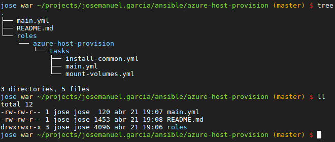

# bash-config

My personal minimalistic bash config for linux anc mac.

Colors look better over a dark grey background, like `#202020`.



## Features

- Clear colors
- History with timestamps
- Bash commands completion
- Git branch in prompt + git commands completion
- Docker commands completion
- Some aliases
  ```
  alias ll='ls -hl'
  alias grep='grep --color'
  alias fuck='sudo $(history -p \!\!)' # Redo last command using sudo
  ```

## Installation

### Linux

```
cd ~
git clone https://github.com/jmgarciamaleno/bash-config.git
mv .bashrc .bashrc_backup
ln -s bash-config/bashrc ~/.bashrc
```
### Mac

```
cd ~
git clone https://github.com/jmgarciamaleno/bash-config.git
mv .bash_profile .bash_profile_backup
ln -s bash-config/bashrc ~/.bash_profile
```

## Uninstallation

### Linux

```
cd ~
unlink .bashrc
mv .bashrc_backup .bashrc
rm -rf bash-config
```
### Mac

```
cd ~
unlink .bash_profile
mv .bash_profile_backup .bash_profile
rm -rf bash-config
```
